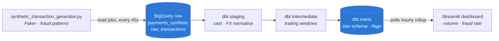

# Real-Time Transaction Analytics on BigQuery

A near-real-time payment analytics pipeline: synthetic transactions are generated
with deliberately planted fraud patterns, loaded into BigQuery in micro-batches,
modelled with dbt into a star schema, flagged by rule-based detection, and
monitored on a live Streamlit dashboard.

The detection rules are **scored against ground truth**, so every accuracy claim
below is reproducible from the repo rather than asserted:

| Rule | Flagged | Precision | Recall† |
|---|---|---|---|
| velocity | 916 | 0.899 | 0.560 |
| geo | 1,764 | **1.000** | 0.993 |
| amount | 1,827 | 0.960 | 0.950 |
| **combined** | **4,309** | **0.962** | **0.849** |

† Against the fraud pattern each rule targets. Combined F1 **0.902**, over
115,200 transactions across 48 hours with a 4.24% planted fraud rate.

---

## Why this project

Monte Carlo's [*Future of Data Analytics: 10 Trends to Watch Out For in
2026*](https://montecarlo.ai/blog-the-future-of-big-data-analytics-and-data-science/)
(Michael Segner, Dec 2025) puts two trends near the top of the list that pull in
opposite directions in practice: **increasing velocity** — real-time streaming
analytics becoming the default, with warehouses like BigQuery making data
queryable on arrival — and **data veracity**, the matching push for quality,
observability and governance to keep accuracy from degrading at that speed.

They pull apart because going faster is precisely what makes correctness harder.
This project is a small, deliberate exercise in holding both at once.

**Velocity** is the spine: the generator emits continuously, ingestion is
micro-batched at 45-second granularity, models compute over trailing windows
rather than whole-history aggregates, and the dashboard polls on an interval.

**Veracity** is what stops that speed from producing confident nonsense. Every
model is tested (72 assertions), the fraud rules are scored against ground truth
rather than asserted to work, and two singular tests structurally enforce that
the ground-truth label never leaks into the rules that are supposed to predict
it. The clearest example of the tension is documented below: the amount rule's
original whole-history baseline scored *better* precisely because it was
cheating on time, and fixing it lowered the reported F1. Velocity without
veracity would have kept the higher number.

The article's other trends — composable architectures, analytics engineering as
a discipline — show up structurally: dbt for transformation, BigQuery for
storage, Streamlit for serving, each swappable.

---

## Architecture



**dbt DAG** — 11 models, 72 tests, all green:

```
stg_transactions ──┬── int_user_rolling_amounts ──┐
                   ├── int_merchant_txn_rates ────┤
                   ├── dim_users ─────────────────┼── fct_transactions
                   └── dim_merchants ─────────────┘        │
fx_rates_to_eur ───┘                                       │
                                                           ├── agg_transactions_hourly
                                                           ├── agg_merchant_daily
                                                           └── fct_transaction_anomalies
                                                                    ├── agg_suspicious_hourly
                                                                    └── agg_anomaly_performance
```

---

## Quick start

```bash
python3.12 -m venv .venv
.venv/bin/pip install -r requirements.txt

gcloud auth application-default login          # BigQuery access
export GCP_PROJECT_ID=your-project-id          # defaults to mine

# 1. Seed 48h of history, then keep generating live
.venv/bin/python synthetic_transaction_generator.py --backfill-hours 48

# 2. Build and test the models
cp dbt_project/profiles.yml.example dbt_project/profiles.yml   # then edit
.venv/bin/dbt build --project-dir dbt_project --profiles-dir dbt_project

# 3. Watch it
.venv/bin/streamlit run dashboard/app.py
```

`location:` in `profiles.yml` must match your raw dataset's region exactly — the
`EU` multi-region is **not** the same place as `europe-west10`, and a mismatch
fails at query time rather than at connection time.

**→ [USAGE.md](USAGE.md)** covers day-to-day operation, tuning the detection
thresholds, resetting the data, sandbox limits, and troubleshooting.

---

## Scoping choices, and why

Portfolio projects are judged as much on judgment as on output. These are the
places where the easy option and the honest one differed.

### Load jobs, not streaming inserts — "near-real-time", not Kafka

Micro-batches land via `load_table_from_dataframe` (load jobs) every 45 seconds.
BigQuery's streaming inserts would be genuinely real-time, but they require a
billing account even inside the free tier; load jobs do not. This project is
therefore **honestly near-real-time with ~45s latency**, and does not claim
stream processing it does not do.

That constraint has a second edge. Load jobs are capped at ~1,500 per table per
day, so a 48-hour backfill at one job per micro-batch would need 1,920 — over the
limit. The backfill generates at the same 45s granularity but flushes once per
simulated hour: 48 jobs instead of 1,920, with identical timestamps.

### Trailing windows, because a static mean is lookahead bias

The amount rule compares each transaction to the user's own baseline. Computing
that baseline as `avg(amount) group by user_id` is the obvious approach and is
wrong: it averages the user's *entire* history, including transactions that
happen **after** the one being scored. No real-time system can consult the
future, so any accuracy it buys is fictional.

`int_user_rolling_amounts` uses a trailing 24-hour window that also excludes the
current row — a large fraudulent amount must not inflate the average it is being
measured against. Fixing this **lowered** the reported score, which is the point:

```
amount precision   0.9994 → 0.960      amount recall  1.000 → 0.950
combined F1        0.9186 → 0.9018
```

Where the window holds fewer than 10 prior transactions the z-score is `null`,
not `0`, and the rule declines to flag. Zero would assert "perfectly average" —
a claim the data cannot support.

### The ground-truth label never touches the rules

`is_fraud_synthetic` exists only to score the rules. Two singular tests enforce
that structurally rather than relying on reviewer trust:

- `assert_flags_independent_of_label` groups by every rule input and fails if
  identical inputs ever produce different flags — the signature of leakage.
- `assert_confusion_matrix_totals` checks the four cells sum to the scored
  population, so a stray null cannot silently drop rows out of the rates.

### Modal country, not previous country

The geo rule first compared each transaction to the user's *previous* country.
Fraud moved the user abroad; their next legitimate transaction moved them back;
both looked like a change. Every geo fraud produced a matching false positive on
the innocent return trip — 1,705 of them, holding precision at 0.51. Comparing
against the user's **modal** country instead took precision to 1.000. A home base
is stable; a previous value is not.

### The dashboard reads a rollup, not the fact table

`fct_transaction_anomalies` is ~23 MiB. A dashboard refreshing every 30 seconds
against it would scan ~2.7 GB/day of a 1 TB monthly allowance and get slower as
history grows. It polls `agg_suspicious_hourly` (49 rows) instead, so refresh
cost is constant regardless of accumulated history.

### Fraud rate is a declared target, not an emergent accident

An earlier generator gave its three fraud branches equal probability, documented
as "~4-5%". The velocity branch emits a *burst* of 5-8 rows per trigger while the
others emit one, so it contributed ~6.5× its apparent share and the realised rate
was **12.1%** — nearly 3× the docstring, and high enough to make detection look
easier than it is. Branch probabilities are now solved for from a declared
`TARGET_FRAUD_RATE`, so the constant and the behaviour cannot drift apart.

---

## What's synthetic, and what that flatters

Being straight about this matters more than the numbers.

- **Geo precision of 1.000 is partly an artifact.** Normal transactions always
  use the user's home country, so a home base is perfectly clean and any
  deviation is fraud by construction. Real users travel. The technique holds —
  modal beats previous regardless — but this is 1.000 *on synthetic data*, not a
  real-world detection rate.
- **Velocity recall is capped at ~0.56 structurally.** In a burst of five, the
  first three transactions have fewer than four behind them and cannot trip a
  window rule. That is a property of windowed detection, not a tuning failure.
- **A 4.24% fraud rate is ~10× reality.** Real card fraud is well under 1%. The
  rate is deliberately inflated to keep the positive class large enough to score
  against; a realistic rate would need far more data for stable metrics.
- **Ground truth is free here and expensive in production.** Scoring against
  `is_fraud_synthetic` is only possible because the data is generated. A real
  system scores against confirmed chargebacks, which arrive weeks late.

---

## Repo layout

```
synthetic_transaction_generator.py   generator + micro-batch loader
dbt_project/
  models/staging/                    cast, FX-normalise
  models/intermediate/               trailing windows (no lookahead)
  models/marts/                      star schema, flags, scoring
  tests/                             singular tests incl. leakage guard
  seeds/fx_rates_to_eur.csv          static FX rates
dashboard/app.py                     Streamlit live monitor
requirements.txt                     pinned; Python 3.12
```

---

## What I'd do next

- **True streaming via Pub/Sub.** Generator publishes to a topic; Dataflow or a
  BigQuery subscription writes continuously. Removes the 45s batch latency and
  the load-job ceiling, at the cost of requiring billing.
- **ML-based detection instead of rules.** The current rules are deliberately
  simple and auditable. `fct_transactions` already carries engineered features
  (trailing z-score, inter-transaction gap, merchant rate) — enough to train a
  gradient-boosted classifier and compare it against this rule baseline. Having
  the baseline scored first is what makes that comparison meaningful.
- **A semantic layer** over the marts, so metric definitions like "fraud rate"
  live in one place instead of being re-expressed per dashboard.
- **Backfill-safe incremental models.** Everything rebuilds fully today, which is
  fine at 115k rows and would not be at 115M.
- **Alerting on the multi-rule tier.** Transactions tripping 2+ rules are fraud
  100% of the time in this dataset — the natural auto-block threshold.
